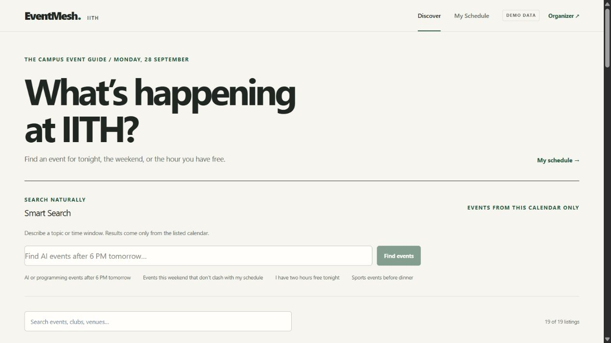
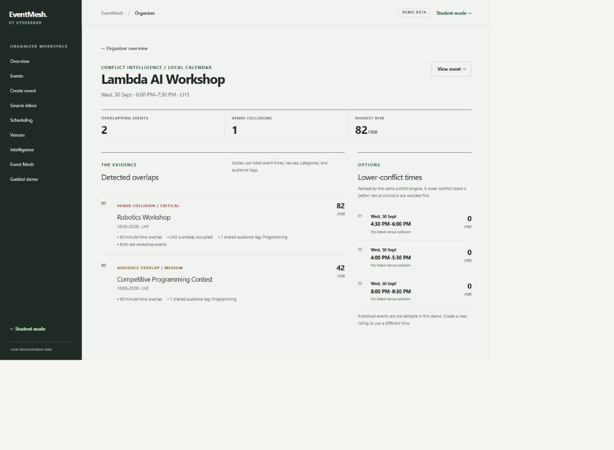
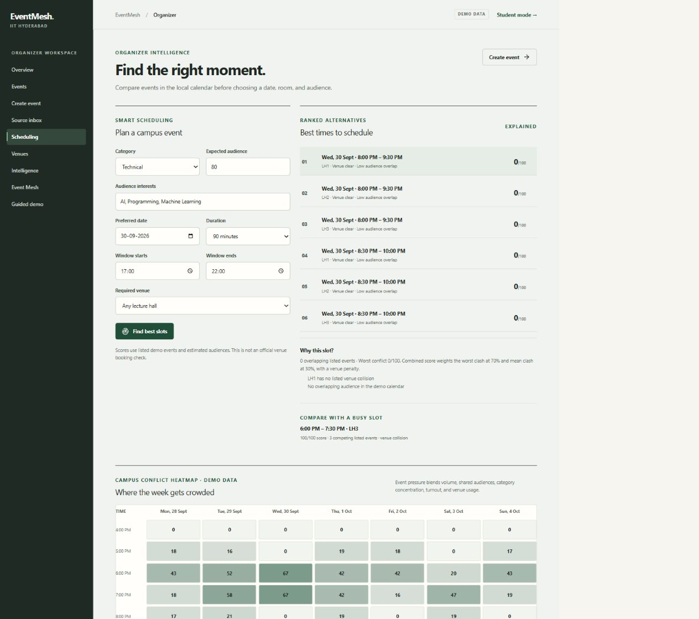
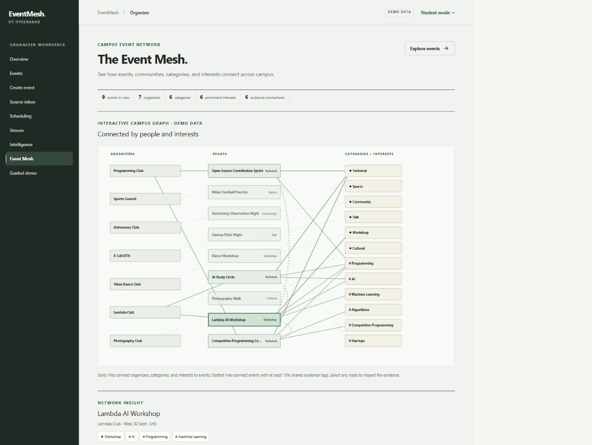
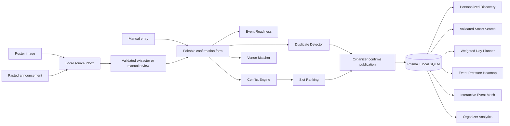

# EventMesh IITH

**One intelligent event layer for the entire campus.**

**Lambda Hackathon 2026 · Smart Campus Solutions for IITH**

**Team:** Arnav Singh and Vikas Gupta · **Hostel:** Bhabha

[](https://github.com/QuantumArnav/Eventmesh/actions/workflows/ci.yml) · [Release report](docs/release-report.md) · [3–4 minute demo script](docs/demo-script.md)

Campus events are scattered across posters, messages, and club channels. EventMesh gives students one place to discover and plan events, while helping organizers turn announcements into listings and avoid scheduling clashes. Its scores are calculated from visible rules and explained in the interface.

The interface has two connected views: a **campus event guide** for students and a **scheduling workspace** for organizers. Start with [Discover](#student-experience) to browse and save events, then use the [guided demo](#guided-demo) to see the organizer checks. The [design audit](docs/design-audit.md) and [design review](docs/design-review.md) explain the visual system and its verification.

**Review path:** [Run locally](#run-locally) → [guided demo](#guided-demo) → [evaluation](#evaluation) → [algorithms](#the-intelligence-explained) → [source map](#source-map).

> **Demo data:** Seed data mixes illustrative events with selected event details adapted from IIT Hyderabad-wide announcements received in 2026. These are static demonstration records and may become outdated. EventMesh is not connected to the institute's official calendar, email system, or venue booking system. Venue profiles, popularity values, and attendance estimates are illustrative. User-created events live only in the local SQLite database.

## See EventMesh

These are screenshots of the running production build with a freshly seeded demo database on 28 September 2026.

| Student Discover | Organizer conflict intelligence |
| --- | --- |
|  |  |

| Scheduling and event pressure | Event Mesh |
| --- | --- |
|  |  |

## Problem

Campus announcements arrive as posters and messages, while organizers often cannot see room collisions or competition for the same audience. Students need one reliable view of what they can actually attend. EventMesh joins these flows around a local event network.

## Solution

EventMesh is a **Campus Event Intelligence Platform**. Organizers turn announcements into editable listings, check duplicates and conflicts, compare venues and slots, and publish deliberately. Students use personalized discovery, Smart Search, and a conflict-free plan.

## What makes it a smart campus solution

| Campus problem | Working EventMesh response | Where to see it |
| --- | --- | --- |
| Students miss relevant events across scattered channels | Searchable feed, structured Smart Search, explained recommendations, and a clash-free plan | `/discover`, `/my-schedule` |
| Organizers spend time retyping announcements | Source inbox for supplied posters or text; extracted or manual drafts remain editable before publication | `/organizer/inbox`, `/organizer/create` |
| Clubs schedule for the same room or audience | Venue and audience conflict scores, deterministic venue matching, duplicate checks, ranked alternatives, and weekly pressure | `/organizer/create`, `/organizer/scheduling` |
| Campus communities are hard to see together | Calculated organizer metrics and an interactive event-organizer-category-interest graph | `/organizer`, `/event-mesh` |

## Why EventMesh is different

| Traditional event listing | EventMesh campus intelligence |
| --- | --- |
| Create → list → register | Ingest → understand → detect → optimize → recommend → coordinate |
| Students search scattered announcements | Students see personalized discovery and an optimized day plan |
| Organizers guess whether a slot is good | Organizers inspect venue, audience, duplicate, and event-pressure signals |
| Scores appear as opaque badges | Main decision scores show their reasons and deterministic formulas |

The project joins **discovery, ingestion, and coordination** in one working flow. A student can choose what to attend; an organizer can see why another time or venue would work better.

The workflow is **ingest → understand → verify → detect → match → optimize → recommend → coordinate**. The app keeps unstructured extraction, deterministic decisions, and data summaries separate; this makes each score inspectable and testable.

### Three kinds of intelligence

| Kind | What it does | Implementation |
| --- | --- | --- |
| **AI / unstructured** | Proposes fields from a supplied poster or announcement and interprets natural-language search as filters | Optional OpenAI extraction and search interpretation; local text and search rules when no key is configured |
| **Deterministic algorithmic** | Scores conflicts, duplicates, venues, event pressure, readiness, schedules, and recommendations | Pure TypeScript engines with reasons, bounded scores, and tests |
| **Data** | Summarizes the current local calendar for organizer decisions | Dashboard metrics, category distribution, venue counts, event pressure, and event graph |

The local text parser is rule based. AI paths require a configured provider key. Neither path creates official campus data.

### Expected impact at IITH

- **Students:** less searching across channels and fewer accidental timetable clashes.
- **Organizers:** earlier notice of competing events or occupied rooms, with explainable alternatives.
- **Campus communities:** clearer visibility into shared interests and opportunities to coordinate.

These are intended benefits. The demo uses synthetic records, so it does not claim measured campus-wide impact.

## Working features

### Student experience

- Search by title, organizer, category, tag, or venue; filter by date and category.
- **Smart Search** interprets phrases such as “AI or programming after 6 PM tomorrow” into validated category, tag, date, time, duration, and saved-schedule constraints. It only returns events already in the local database. A free-time query can produce a weighted, non-overlapping plan.
- Explainable 0–100 recommendations using demo interests, category preferences, time, popularity, and organizer affinity.
- Event details, related events, registration deadlines, and saved-event clash warnings.
- Interested, Saved, and Must Attend priorities persisted in SQLite.
- **Build My Plan:** weighted interval scheduling selects the highest-utility set of non-overlapping events and explains skipped events.
- Export one event or the current schedule/optimized plan as a local `.ics` calendar file.

### Organizer experience

- Create an event manually, upload a poster for optional AI vision extraction, or paste a text announcement.
- Stage supplied posters or announcements in a persistent **Source Inbox**. Text is parsed into a review draft; a poster remains `NEW` for manual review if no AI key is configured. Review states include Needs Review, Duplicate, Conflict Found, Ready to Publish, and Published. The source and event are linked on publication.
- If no API key is configured, pasted text uses a **clearly labeled deterministic local parser** for common titles, dates, times, venues, tags, and explicit registration dates; poster extraction falls back to manual entry. Extracted fields are always editable and never auto-published.
- Important extracted fields show evidence-based **High confidence**, **Review suggested**, or **Uncertain** labels. Relative dates without a source date and incomplete venues remain empty with warnings. These labels are heuristic evidence tiers, not calibrated AI probabilities.
- **Smart Venue Intelligence** ranks seeded venue profiles using audience fit (30 points), requested facilities (25), listed-calendar availability (25), type suitability (10), and concurrent event pressure (10). It explains missing facilities, oversized rooms, and collisions. A preferred-area mismatch subtracts eight points.
- Zod validation, a transparent Event Readiness score, and duplicate suggestions before publishing.
- The organizer form shows an **intelligence pipeline** driven by actual draft validity and analysis state. Structured extraction is marked complete, pending, or skipped according to the source. Reusable explanation panels show recommendation, duplicate, conflict, venue, slot, and readiness reasons; unfinished checks stay visibly pending.
- Conflict Intelligence distinguishes venue collisions from audience overlap, shows reasons, and offers lower-conflict alternatives.
- Scheduling Intelligence compares candidate dates, time windows, durations, audience tags, and venues using the same conflict engine.
- A clickable weekly Event Pressure heatmap blends simultaneous events, shared interests, category concentration, estimated audience, and occupied venues.
- Organizer dashboard computes events in the next seven days, high-conflict events, quieter hours, peak event hours, readiness, category mix, audience pairs, and pressure from current local data.
- The dashboard also shows which named venues host the most listed events. This is a local listing count, not official booking utilization.
- Interactive Event Mesh graph connects events, organizers, categories, interests, and shared audiences.
- Event detail pages have a copyable URL, a QR code for the current page URL, event-specific social metadata, and transparent listing checks. A QR code generated on `localhost` is for local demonstration; external scanning needs a deployed URL.

## Guided demo

Open `/demo` first. Its proposed Lambda workshop is compared with seeded listings by the real duplicate, conflict, slot, and venue engines. The route shows the detected signals without creating an event, followed by **How EventMesh Works**, an eight-stage judge-facing explanation of the methods and their purpose. Then open `/organizer/create`, select **Load demo example**, and run the conflict check yourself. Dates follow the existing seeded Lambda workshop, so the scenario remains connected even when the seed database was created earlier.

The [3–4 minute speaking script](docs/demo-script.md) gives a concise sequence for judges.

## Run locally

**Requirements:** Node.js 24 and npm. No hosted database, account, or API key is required for the seeded demo.

```bash
git clone https://github.com/QuantumArnav/Eventmesh.git eventmesh-iith
cd eventmesh-iith
npm ci
```

Create `.env` from `.env.example`:

```powershell
# Windows PowerShell
Copy-Item .env.example .env
```

```bash
# macOS / Linux
cp .env.example .env
```

Start the local database and app:

```bash
npm run db:setup
npm run dev
```

Open **http://localhost:3000**. `db:setup` creates SQLite, applies five committed migrations, and inserts 19 labeled demo events, seven illustrative venue profiles, a demo student profile, and a six-event plan. It is safe to rerun: existing events and choices remain, and missing venue links are backfilled. If port 3000 is busy, use the URL printed by Next.js.

The local database is `prisma/dev.db`; it and `.env` are Git-ignored. To use a different SQLite file, change `DATABASE_URL` in `.env` before setup.

### Environment variables

| Variable | Purpose |
| --- | --- |
| `DATABASE_URL` | Local SQLite path; default `file:./dev.db` |
| `OPENAI_API_KEY` | Optional key for poster/text extraction and Smart Search interpretation |
| `OPENAI_VISION_MODEL` | Optional compatible vision model; default `gpt-4.1-mini` |
| `OPENAI_SEARCH_MODEL` | Optional Smart Search interpretation model; default `gpt-4.1-mini` |

The key stays on the server and is not exposed as `NEXT_PUBLIC_`. Without a key, pasted text and Smart Search use clearly labeled local rules, while poster upload falls back to manual entry. The OpenAI integration is implemented but **has not been live-tested with a key**; its result depends on valid credentials and available quota.

There are no demo credentials. **Discover / My Schedule** are the student view; **Organizer / Create event / Scheduling / Event Mesh** are organizer intelligence views. Production authentication and official campus integrations are outside this hackathon MVP.

## Three-minute judge walkthrough

1. **Start with a calculated scenario.** Open `/demo`. Read the duplicate, venue collision, audience overlap, better slot, and venue match; all come from seeded records through the same production engines.
2. **Find a reason to attend.** Open `/discover`, try “AI or programming after 6 PM tomorrow” in Smart Search, then open an event. The structured filters are inspectable.
3. **Resolve a student's clash.** Open `/my-schedule`. The seeded profile tracks six events; click **Build my plan**. Compare selected and skipped events, then change one priority to **Must Attend** and recalculate.
4. **Turn a message into an event.** Open `/organizer/create`, select **Paste announcement**, click **Use demo announcement**, then **Extract details**. Without a key, the UI says **Local text parser**. Review the confidence cues and edit fields before continuing.
5. **Show the coordination problem.** Click **Load demo example**, review venue ranking, then run the duplicate and conflict review. The seeded scenario finds a possible duplicate, an LH3 collision, and a programming-audience overlap. The organizer can view the existing event or continue anyway.
6. **Find a better slot.** Open `/organizer/scheduling`. Compare ranked slots and inspect a busy heatmap cell.
7. **See the campus network.** Open `/event-mesh` and select an event, organizer, category, or interest. The panel explains the connections and links back to event details.

These results are calculated from seeded records, not hardcoded into the screens. Fresh setup generates dates relative to the setup day, so the scenario stays usable after the hackathon. No publication is required to show the demo.

## Architecture



This is one Next.js application. API routes own writes and provider calls. Pure TypeScript modules hold the algorithms and are tested independently from the UI. Additive migrations preserve prior events and saved preferences. `Event.venueId` links recognized names to the Venue table while retaining the original venue text for historical and unrecognized locations.

## Intelligence pipeline

1. **Unstructured input:** optional OpenAI extraction for a user-provided poster or announcement; otherwise a local text parser for announcements.
2. **Human review and schema validation:** the organizer edits every field; Zod checks required details and time ordering.
3. **Deterministic decisions:** duplicate, conflict, venue, scheduling, event pressure, recommendation, and plan engines produce scores and reasons.
4. **Persistence and discovery:** confirmed events enter local SQLite and become visible to the student and organizer views.

## The intelligence, explained

These are deterministic decision aids, not predictions of actual attendance, official room availability, or a trained ML model.

| Engine | How it works |
| --- | --- |
| **Conflict** | First require real time overlap. Same-venue score starts at 55 and adds overlap, tag similarity, and category points. Different venues use overlap, tag Jaccard similarity, category, and bounded audience size. Results include kind, severity, and reasons. |
| **Scheduling** | Enumerate 30-minute starts across the requested window, venues, and up to three days. Run the conflict engine for every candidate. Combined score is `0.7 × worst conflict + 0.3 × mean conflict + 15 if venue collides`. Rank available venues first, then lower score. |
| **Duplicate** | Weighted similarity: title 32, organizer 18, date 22, start time 10, venue 10, tags 8. Title uses token Jaccard and normalized edit distance. Distant dates sharply reduce the score; a match needs at least 70/100 and a sufficiently similar title. Organizers may continue anyway. |
| **Venue Match** | Capacity fit prefers roughly 55–90% expected occupancy; undersized rooms get zero capacity points and oversized rooms lose points. Facilities, available listed-calendar time, event-type fit, and concurrent large events complete the score. It is a suggestion, never a booking guarantee. |
| **Smart Search** | With an API key, AI converts a phrase into Zod-validated filters only. Without a key or on provider failure, local phrase rules do the same. The server reads stored events and applies the filters; the existing recommendation engine ranks them. For a free-time window, the existing weighted interval scheduler selects a compatible plan. The model never supplies event results. |
| **Event Pressure** | Hourly score combines event count (up to 35), pairwise audience-tag similarity (up to 20), category concentration (15), estimated audience (15), and fraction of listed venues occupied (15). Empty hours score zero. Click a cell for contributing events and reasons. |
| **Event Readiness** | Field completeness: title 10, date 15, valid time range 15, venue 15, useful description 10, category 10, tags 10, deadline 5, organizer 5, estimated audience 5. Missing optional details lower the score but never block publication. |
| **Recommendation** | Interest match 45, category 20, suitable time 15, demo popularity 10, organizer affinity 10. The score is bounded to 0–100 and includes reasons. |
| **Day Planner** | Weighted interval scheduling. Utility is recommendation score + 80 for Must Attend or + 20 for Saved, plus one point. Sort by end time, find the previous compatible event, use dynamic programming, and reconstruct the optimum. |
| **Event Mesh** | A small graph of upcoming events, organizers, categories, and prominent tags. Dotted audience links require at least 15% tag Jaccard overlap; clicking nodes reveals the actual connection. |

## AI usage

OpenAI, when configured, converts a user-supplied poster or announcement into a proposed structured draft and interprets Smart Search text as filters. It does not invent event results, publish automatically, book rooms, or calculate conflict and recommendation scores. Without credentials, text parsing and Smart Search interpretation use local rules; poster input requires manual entry. The live AI paths have not been evaluated with real credentials; see [evaluation limits](docs/evaluation.md).

## Evaluation

Run `npm run evaluate`. The [measured synthetic evaluation](docs/evaluation.md) reports duplicate precision/recall/F1, exact field matches on 15 text announcements, conflict cases, a greedy-failure schedule case, and venue matching cases. Its sample is small and does not validate real campus accuracy.

## Technical stack

- Next.js 16 App Router, React 19, strict TypeScript
- Tailwind CSS 4 / custom design system, Lucide icons
- Prisma 6 + SQLite with committed migrations and seed data; Sharp decodes uploaded posters before acceptance
- Zod 4 validation
- OpenAI Responses API for optional vision/text extraction
- Vitest for algorithmic tests

## Database schema

`Event` stores validated event fields, text venue, optional `venueId`, and an optional unique submission key for newly created events. `Venue` holds illustrative capacity, area, type, and facility flags. `EventSource` stores a supplied text or poster locally with extraction output and review status; a publication links back to the created event. `StudentProfile` stores demo interests; `SavedEvent` connects the demo student to listed events with Interested, Saved, or Must Attend priority. Existing event rows remain valid after venue migration.

```text
app/                Pages and API route handlers
components/         Navigation and reusable event UI
lib/                Pure engines, dates, validation, database access
lib/ai/             Unified optional extraction provider
prisma/             Schema, additive migrations, demo seed
scripts/            Local SQLite setup helper
tests/              Engine and export tests
evaluation/         Offline synthetic benchmark
docs/               Measured report and judge script
```

## Development checks

```bash
npm run typecheck
npm run lint
npm test
npm run evaluate
npm run build
npm audit --audit-level=moderate
```

At the 28 September release checkpoint, 43 tests, ESLint, TypeScript, a clean production build, and the offline evaluation passed. Four tests exercise mocked AI provider success and failure paths. Re-run the commands above in your environment; the optional live OpenAI paths remain unverified without credentials. The release build also passed `npm audit --audit-level=moderate` with zero reported vulnerabilities.

## Deployment

The committed Dockerfile supports a single-container deployment with a persistent SQLite volume at `/app/prisma/data`, `DATABASE_URL=file:./data/dev.db`, startup migrations and seed, and a database-backed `/api/health` check. [GitHub Actions](https://github.com/QuantumArnav/Eventmesh/actions/runs/36462480659) verified an event survives container recreation with the same volume. See the [deployment guide](docs/deployment.md) for exact Railway steps and the paid-disk Render alternative. A public production URL has **not** been verified, so this README does not claim a live hosted demo. The previously shared Cloudflare tunnel is temporary and depends on the owner's computer.

See the [final quality checks](docs/quality-checks.md) for runtime, accessibility, performance, and deployment evidence with its limits.

## Source map

| If you want to review… | Start here |
| --- | --- |
| Venue and audience conflict scoring | [`lib/conflict-engine.ts`](lib/conflict-engine.ts), [`tests/engines.test.ts`](tests/engines.test.ts) |
| Slot ranking and event pressure | [`lib/scheduling-engine.ts`](lib/scheduling-engine.ts), [`lib/event-pressure.ts`](lib/event-pressure.ts) |
| Duplicate detection and publish readiness | [`lib/duplicate-detector.ts`](lib/duplicate-detector.ts), [`lib/event-readiness.ts`](lib/event-readiness.ts) |
| Weighted student plan | [`lib/schedule-optimizer.ts`](lib/schedule-optimizer.ts), [`tests/intelligence.test.ts`](tests/intelligence.test.ts) |
| Optional AI extraction and its validated local fallback | [`lib/ai/event-extractor.ts`](lib/ai/event-extractor.ts), [`app/api/extract/route.ts`](app/api/extract/route.ts) |
| Venue model, scoring, and UI | [`prisma/schema.prisma`](prisma/schema.prisma), [`lib/venue-matcher.ts`](lib/venue-matcher.ts), [`components/venue-advisor.tsx`](components/venue-advisor.tsx) |
| Smart Search and guided demo | [`lib/smart-search.ts`](lib/smart-search.ts), [`components/smart-search.tsx`](components/smart-search.tsx), [`app/demo/page.tsx`](app/demo/page.tsx) |
| Reproducible measurements | [`evaluation/run.ts`](evaluation/run.ts), [`docs/evaluation.md`](docs/evaluation.md) |
| Persistent source review | [`app/organizer/inbox/page.tsx`](app/organizer/inbox/page.tsx), [`app/api/inbox/route.ts`](app/api/inbox/route.ts), [`lib/inbox-store.ts`](lib/inbox-store.ts) |
| Event graph and calendar export | [`lib/event-graph.ts`](lib/event-graph.ts), [`lib/ics.ts`](lib/ics.ts) |
| Local data and repeatable demo setup | [`prisma/schema.prisma`](prisma/schema.prisma), [`prisma/seed.ts`](prisma/seed.ts), [`scripts/ensure-db.mjs`](scripts/ensure-db.mjs) |

The screenshots above show the current UI; the diagram shows the data flow for a GitHub-only review.

## Limits and next steps

The app does not ingest private WhatsApp messages, emails, or club pages automatically. It processes only a poster or announcement intentionally provided by a user. Poster bytes and raw announcement text are stored in SQLite when staged in the inbox; there is no retention policy or production access control, so a public demo must use disposable content and access protection. It does not reserve official venues. Organizer and student views share one clearly labeled demo profile; there is no production authentication. A campus deployment would need identity and permissions, verified organizers, official venue feeds, and consent-aware data handling. Optional ideas from the initial brief such as a separate calendar page and light mode were not implemented; the working scheduling heatmap and timeline cover the core use cases.

## Data disclaimer

**The current prototype uses static demo seed data. It is not the official IITH event or venue booking system.** Some seeded event details are adapted from IIT Hyderabad announcements; other events are illustrative scenarios for the guided demo. Seeded information may become outdated because it is not synchronized with institute email or calendar systems. Venue capacities, facility flags, popularity, and attendance estimates are illustrative. EventMesh only checks collisions against its own local records.

## Future scope

With campus approval: verified organizer identity, official room inventory and bookings, consented event feeds, multi-user accounts, and evaluation on independently labeled real announcements. These are proposals, not current features. See [future integration boundaries](docs/future-integrations.md) for the adapter shape and required review steps.

## Team

- **Team members:** Arnav Singh and Vikas Gupta
- **Hostel:** Bhabha

## Open-source acknowledgements

Built during the hackathon using the open-source frameworks and libraries listed in `package.json`: Next.js, React, Prisma, Zod, Sharp, Tailwind CSS, Lucide, qrcode.react, and Vitest. No pre-existing EventMesh application code or external UI template was used. Optional extraction calls the OpenAI API through its SDK.
