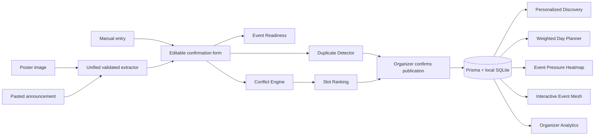

# EventMesh IITH

**One intelligent event layer for the entire campus.**

**Lambda Hackathon 2026 · Smart Campus Solutions for IITH**

**Team:** Arnav and Vikas Gupta · **Hostel:** Bhabha

Campus events are scattered across posters, messages, and club channels. EventMesh gives students one place to discover and plan events, while helping organizers turn announcements into listings and avoid scheduling clashes. Its scores are calculated from visible rules and explained in the interface.

**Review path:** [Run locally](#run-locally) → [three-minute demo](#three-minute-judge-walkthrough) → [algorithms](#the-intelligence-explained) → [source map](#source-map).

> **Demo data:** All seeded events, venues, organizer names, popularity values, and attendance estimates are illustrative. They are not the official IIT Hyderabad calendar, venue booking system, or live campus statistics. User-created events live only in the local SQLite database.

## What makes it a smart campus solution

| Campus problem | Working EventMesh response | Where to see it |
| --- | --- | --- |
| Students miss relevant events across scattered channels | Searchable feed, explained recommendations, and a clash-free plan built from saved events | `/discover`, `/my-schedule` |
| Organizers spend time retyping announcements | Poster or pasted-text extraction into a validated, editable form | `/organizer/create` |
| Clubs schedule for the same room or audience | Venue and audience conflict scores, duplicate checks, ranked alternatives, and a weekly pressure heatmap | `/organizer/create`, `/organizer/scheduling` |
| Campus communities are hard to see together | Calculated organizer metrics and an interactive event-organizer-category-interest graph | `/organizer`, `/event-mesh` |

## Why EventMesh is different

| Traditional event listing | EventMesh campus intelligence |
| --- | --- |
| Create → list → register | Ingest → understand → detect → optimize → recommend → coordinate |
| Students search scattered announcements | Students see personalized discovery and an optimized day plan |
| Organizers guess whether a slot is good | Organizers inspect venue, audience, duplicate, and event-pressure signals |
| Scores appear as opaque badges | Main decision scores show their reasons and deterministic formulas |

The project joins **discovery, ingestion, and coordination** in one working flow. A student can choose what to attend; an organizer can see why another time or venue would work better.

### Expected impact at IITH

- **Students:** less searching across channels and fewer accidental timetable clashes.
- **Organizers:** earlier notice of competing events or occupied rooms, with explainable alternatives.
- **Campus communities:** clearer visibility into shared interests and opportunities to coordinate.

These are intended benefits. The demo uses synthetic records, so it does not claim measured campus-wide impact.

## Working features

### Student experience

- Search by title, organizer, category, tag, or venue; filter by date and category.
- Explainable 0–100 recommendations using demo interests, category preferences, time, popularity, and organizer affinity.
- Event details, related events, registration deadlines, and saved-event clash warnings.
- Interested, Saved, and Must Attend priorities persisted in SQLite.
- **Build My Plan:** weighted interval scheduling selects the highest-utility set of non-overlapping events and explains skipped events.
- Export one event or the current schedule/optimized plan as a local `.ics` calendar file.

### Organizer experience

- Create an event manually, upload a poster for optional AI vision extraction, or paste a text announcement.
- If no API key is configured, pasted text uses a **clearly labeled deterministic local parser**; poster extraction falls back to manual entry. Extracted fields are always editable and never auto-published.
- Zod validation, a transparent Event Readiness score, and duplicate suggestions before publishing.
- Conflict Intelligence distinguishes venue collisions from audience overlap, shows reasons, and offers lower-conflict alternatives.
- Scheduling Intelligence compares candidate dates, time windows, durations, audience tags, and venues using the same conflict engine.
- A clickable weekly Event Pressure heatmap blends simultaneous events, shared interests, category concentration, estimated audience, and occupied venues.
- Organizer dashboard computes event counts, high-conflict events, quieter hours, readiness, category mix, audience pairs, and pressure from current local data.
- Interactive Event Mesh graph connects events, organizers, categories, interests, and shared audiences.

## Run locally

**Requirements:** Node.js 24 (or another version supported by Next.js 16) and npm. No hosted database, account, or API key is required for the seeded demo.

```bash
git clone https://github.com/QuantumArnav/Eventmesh.git eventmesh-iith
cd eventmesh-iith
npm ci
```

Create `.env` from `.env.example`:

```powershell
# Windows PowerShell
Copy-Item .env.example .env
```

```bash
# macOS / Linux
cp .env.example .env
```

Start the local database and app:

```bash
npm run db:setup
npm run dev
```

Open **http://localhost:3000**. `db:setup` creates SQLite, applies both committed migrations, and inserts 18 labeled demo events, a demo student profile, and a six-event plan. It is safe to rerun: existing events and choices remain. If port 3000 is busy, use the URL printed by Next.js.

The local database is `prisma/dev.db`; it and `.env` are Git-ignored. To use a different SQLite file, change `DATABASE_URL` in `.env` before setup.

### Environment variables

| Variable | Purpose |
| --- | --- |
| `DATABASE_URL` | Local SQLite path; default `file:./dev.db` |
| `OPENAI_API_KEY` | Optional key for poster vision and AI text extraction |
| `OPENAI_VISION_MODEL` | Optional compatible vision model; default `gpt-4.1-mini` |

The key stays on the server and is not exposed as `NEXT_PUBLIC_`. Without a key, pasted text uses a clearly labeled local parser and poster upload falls back to manual entry. The OpenAI integration is implemented but **has not been live-tested with a key**; its result depends on valid credentials and available quota.

There are no demo credentials. **Discover / My Schedule** are the student view; **Organizer / Create event / Scheduling / Event Mesh** are organizer intelligence views. Production authentication and official campus integrations are outside this hackathon MVP.

## Three-minute judge walkthrough

1. **Find a reason to attend.** Open `/discover`, search for `AI`, then open an event. Its relevance score names the matching interests, and the detail page shows related events.
2. **Resolve a student's clash.** Open `/my-schedule`. The seeded profile tracks six events; click **Build my plan**. Compare selected and skipped events, then change one priority to **Must Attend** and recalculate.
3. **Turn a message into an event.** Open `/organizer/create`, select **Paste announcement**, click **Use demo announcement**, then **Extract details**. Without a key, the UI says **Local text parser**. Review and edit the extracted fields before continuing.
4. **Show the coordination problem.** Run the duplicate and conflict review. The seeded scenario finds a possible duplicate, an LH3 venue collision, and a separate programming-audience overlap. The organizer can view the existing event or continue anyway.
5. **Find a better slot.** Open `/organizer/scheduling`. Compare ranked slots, then click the third seeded day at 6 PM on the heatmap. The details explain which events, audiences, and venues create pressure.
6. **See the campus network.** Open `/event-mesh` and select an event, organizer, category, or interest. The panel explains the connections and links back to event details.

These results are calculated from seeded records, not hardcoded into the screens. Fresh setup generates dates relative to the setup day, so the scenario stays usable after the hackathon. No publication is required to show the demo.

## Architecture



This is one Next.js application. API routes own writes and provider calls. Pure TypeScript modules hold the algorithms and are tested independently from the UI. The only schema extension beyond the first MVP is a `preference` field on saved events; its additive migration preserves existing rows with `SAVED` as the default.

## The intelligence, explained

These are deterministic decision aids, not predictions of actual attendance, official room availability, or a trained ML model.

| Engine | How it works |
| --- | --- |
| **Conflict** | First require real time overlap. Same-venue score starts at 55 and adds overlap, tag similarity, and category points. Different venues use overlap, tag Jaccard similarity, category, and bounded audience size. Results include kind, severity, and reasons. |
| **Scheduling** | Enumerate 30-minute starts across the requested window, venues, and up to three days. Run the conflict engine for every candidate. Combined score is `0.7 × worst conflict + 0.3 × mean conflict + 15 if venue collides`. Rank available venues first, then lower score. |
| **Duplicate** | Weighted similarity: title 32, organizer 18, date 22, start time 10, venue 10, tags 8. Title uses token Jaccard and normalized edit distance. Distant dates sharply reduce the score; a match needs at least 70/100 and a sufficiently similar title. Organizers may continue anyway. |
| **Event Pressure** | Hourly score combines event count (up to 35), pairwise audience-tag similarity (up to 20), category concentration (15), estimated audience (15), and fraction of listed venues occupied (15). Empty hours score zero. Click a cell for contributing events and reasons. |
| **Event Readiness** | Field completeness: title 10, date 15, valid time range 15, venue 15, useful description 10, category 10, tags 10, deadline 5, organizer 5, estimated audience 5. Missing optional details lower the score but never block publication. |
| **Recommendation** | Interest match 45, category 20, suitable time 15, demo popularity 10, organizer affinity 10. The score is bounded to 0–100 and includes reasons. |
| **Day Planner** | Weighted interval scheduling. Utility is recommendation score + 80 for Must Attend or + 20 for Saved, plus one point. Sort by end time, find the previous compatible event, use dynamic programming, and reconstruct the optimum. |
| **Event Mesh** | A small graph of upcoming events, organizers, categories, and prominent tags. Dotted audience links require at least 15% tag Jaccard overlap; clicking nodes reveals the actual connection. |

## Technical stack

- Next.js 16 App Router, React 19, strict TypeScript
- Tailwind CSS 4 / custom design system, Lucide icons
- Prisma 6 + local SQLite with committed migrations and seed data
- Zod 4 validation
- OpenAI Responses API for optional vision/text extraction
- Vitest for algorithmic tests

```text
app/                Pages and API route handlers
components/         Navigation and reusable event UI
lib/                Pure engines, dates, validation, database access
lib/ai/             Unified optional extraction provider
prisma/             Schema, additive migrations, demo seed
scripts/            Local SQLite setup helper
tests/              Engine and export tests
```

## Development checks

```bash
npm run typecheck
npm run lint
npm test
npm run build
npm audit --audit-level=moderate
```

The final audit on a fresh database passed **21 unit tests**, ESLint, TypeScript typecheck, a production build, and npm audit with zero reported vulnerabilities. The scoped overrides in `package.json` update two transitive Prisma packages with published fixes; the migration and seed commands also passed with those versions. A production server returned HTTP 200 for the landing, discovery, schedule, organizer, creation, scheduling, and Event Mesh routes; the fresh API returned 18 events and six saved choices. A pasted announcement returned `Local text parser`, and the conflict API returned a duplicate, conflicts, and slot suggestions. The optional live OpenAI path is the one flow not verified with real credentials.

## Source map

| If you want to review… | Start here |
| --- | --- |
| Venue and audience conflict scoring | [`lib/conflict-engine.ts`](lib/conflict-engine.ts), [`tests/engines.test.ts`](tests/engines.test.ts) |
| Slot ranking and event pressure | [`lib/scheduling-engine.ts`](lib/scheduling-engine.ts), [`lib/event-pressure.ts`](lib/event-pressure.ts) |
| Duplicate detection and publish readiness | [`lib/duplicate-detector.ts`](lib/duplicate-detector.ts), [`lib/event-readiness.ts`](lib/event-readiness.ts) |
| Weighted student plan | [`lib/schedule-optimizer.ts`](lib/schedule-optimizer.ts), [`tests/intelligence.test.ts`](tests/intelligence.test.ts) |
| Optional AI extraction and its validated local fallback | [`lib/ai/event-extractor.ts`](lib/ai/event-extractor.ts), [`app/api/extract/route.ts`](app/api/extract/route.ts) |
| Event graph and calendar export | [`lib/event-graph.ts`](lib/event-graph.ts), [`lib/ics.ts`](lib/ics.ts) |
| Local data and repeatable demo setup | [`prisma/schema.prisma`](prisma/schema.prisma), [`prisma/seed.ts`](prisma/seed.ts), [`scripts/ensure-db.mjs`](scripts/ensure-db.mjs) |

The interface itself is the visual demonstration; the diagram above shows the data flow for a GitHub-only review.

## Limits and next steps

The app does not ingest private WhatsApp messages, emails, or club pages automatically. It processes only a poster or announcement intentionally provided in the create form. It does not reserve official venues. Organizer and student views share one clearly labeled local demo profile; there is no production authentication. A campus deployment would need identity and permissions, verified organizers, official venue feeds, and consent-aware data handling. Optional ideas from the initial brief such as a separate calendar page and light mode were not implemented; the working scheduling heatmap and timeline cover the core use cases.

## Team

- **Team members:** Arnav and Vikas Gupta
- **Hostel:** Bhabha

## Open-source acknowledgements

Built during the hackathon using the open-source frameworks and libraries listed in `package.json`: Next.js, React, Prisma, Zod, Tailwind CSS, Lucide, and Vitest. No pre-existing EventMesh application code or external UI template was used. Optional extraction calls the OpenAI API through its SDK.
