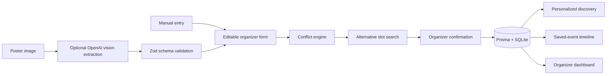

# EventMesh IITH

**One intelligent event layer for the entire campus.**

EventMesh turns fragmented campus event information into an intelligent, searchable, and conflict-aware event network. It is a hackathon MVP for the **Smart Campus Solutions for IITH** theme.

> **Demo data:** The included events, organizers, venues, attendance estimates, popularity values, and profile are illustrative seed data. They do **not** represent the official IIT Hyderabad calendar, venue booking system, or live campus statistics. Events created in your local copy remain in your local SQLite database.

## The problem

Campus events are announced across posters, chats, club pages, email, and word of mouth. Students struggle to discover what is relevant, while organizers may unknowingly choose the same venue or compete for the same audience at the same time.

## The solution and USP

EventMesh provides one flow from event creation to student discovery:

1. An organizer enters event details or uploads a poster for optional AI-assisted extraction.
2. The organizer reviews and edits every field. Extraction never publishes automatically.
3. Conflict Intelligence checks venue collisions and audience overlap against existing events, explains each score, and proposes lower-conflict slots.
4. The organizer confirms and publishes.
5. Students discover relevant events, see why they were recommended, save them, and inspect schedule clashes.

**USP:** EventMesh helps the campus coordinate events, rather than merely listing them.

## What works in this MVP

- Search across event title, organizer, category, tags, and venue.
- Filter by Today, Tomorrow, This Week, and event category.
- Detailed event pages with related events and saved-event clash warnings.
- Transparent weighted recommendations for the demo student.
- Working save/remove action and My Schedule timeline with overlap warnings.
- Manual event creation with Zod validation.
- PNG/JPEG/WebP poster upload and optional OpenAI vision extraction, always followed by an editable confirmation form.
- Safe manual fallback when no API key is present or extraction fails.
- Venue and audience conflict scoring, with reasons and ranked alternative slots.
- Organizer dashboard based on the current local database.
- A dynamically generated sample poster and demo form example to make the flow easy to try.

## Quick start

**Requirements:** Node.js 24 (or a supported current Node.js release) and npm. No external database service is needed.

```bash
git clone https://github.com/QuantumArnav/Eventmesh.git eventmesh-iith
cd eventmesh-iith
npm install
```

Create the local environment file:

```bash
# macOS / Linux
cp .env.example .env

# Windows PowerShell
Copy-Item .env.example .env
```

Then run:

```bash
npm run db:setup
npm run dev
```

Open **http://localhost:3000**. `db:setup` creates the SQLite file, applies the committed migration, and inserts 18 demo events. Running it again preserves existing events and saved data. If port 3000 is already occupied, use the port printed by Next.js.

### Optional poster extraction

Add your own `OPENAI_API_KEY` to `.env`, then restart `npm run dev`. `OPENAI_VISION_MODEL` defaults to `gpt-4.1-mini` and can be changed to a compatible vision model. The key stays server-side; it is never exposed as a `NEXT_PUBLIC_` variable. Without a key, upload returns a clear fallback message and the manual form remains fully usable.

The demo role switch is the sidebar/navigation: **Discover** and **My Schedule** are the student view; **Organizer** and **Create event** are the organizer view. There are no credentials or production authentication in this MVP.

## Two-minute judge demo

1. Open **Discover**. Search `AI` and show a relevance score plus its plain-language reason.
2. Save two overlapping events. Open **My Schedule** to show the timeline warning.
3. Open **Organizer → Create event**. Choose **Load demo example** to populate a proposed event at LH3, or **Upload poster → Use sample poster** to try vision extraction when an API key is available.
4. Click **Check conflicts**. Show the LH3 venue collision, the separate Programming Club audience overlap, and their explanations.
5. Select a lower-conflict slot. The same conflict engine recalculates the score.
6. Publish. Open the published event in the student view.

The seeded calendar intentionally contains overlapping events so these steps work on a fresh setup. The sample poster is generated for two days after the day it is opened; the seed events are generated for the same relative dates when the database is first set up.

## Architecture



This is one Next.js application. The database stores events, a demo student profile, and saved-event links. API routes own server-side writes and extraction. Pure TypeScript modules hold the recommendation and conflict algorithms so they can be tested independently of the UI.

### Conflict Intelligence

The engine first computes actual time overlap. Events on different dates or with only touching boundaries do not conflict. If overlapping events share a venue, the score starts at a severe baseline; otherwise the score reflects overlap duration, tag similarity, category similarity, and a bounded audience-size factor. Results include a score, severity, conflict type, and human-readable reasons. Alternative slots are candidate times ranked using **the same engine**, with venue collisions avoided first. Scores are decision aids, not actual attendance forecasts or official room availability.

### Personalized Discovery

The recommendation score is a transparent weighted rule, **not a trained ML model**:

| Factor | Maximum points |
| --- | ---: |
| Interest/tag overlap | 45 |
| Preferred category | 20 |
| Time suitability | 15 |
| Demo popularity | 10 |
| Organizer affinity | 10 |

Scores are bounded to 0–100 and accompanied by an explanation. The sample profile uses interests in AI, programming, football, and startups; there is no real student profiling or tracking.

## Tech stack and structure

- **Next.js 16 App Router**, React, strict TypeScript
- **CSS/Tailwind 4**, Lucide icons
- **Prisma 6 + local SQLite**
- **Zod 4** validation
- **OpenAI Responses API** with a vision model when configured
- **Vitest** for algorithmic tests

```text
app/                Pages and API route handlers
components/         Navigation and reusable event UI
lib/                Dates, data access, validation, algorithms
lib/ai/             Provider-facing poster extraction module
prisma/             Schema, committed migration, seed data
scripts/            Local SQLite setup helper
tests/              Conflict and recommendation engine tests
```

## Development commands

```bash
npm run dev          # local development server
npm run typecheck    # TypeScript validation
npm run lint         # ESLint
npm test             # algorithm tests
npm run build        # optimized production build
npm run db:migrate -- --name your_change  # create a new local migration
```

## Screenshots

Screenshots can be added here before final presentation. The working app is the source of truth for this submission.

## Limits and future scope

This MVP does not ingest real WhatsApp, Instagram, email, or club announcements automatically. Poster extraction processes only images an organizer deliberately uploads. It does not reserve official venues. The student profile and role switch are local demo fixtures; a real deployment would need authentication, organizer verification, permissions, official venue integration, and consent-aware campus data access. These are future integrations, not features claimed as complete.

## Team

Add team members and hostel block here before submitting the public repository.

## Open-source acknowledgements

Built during the hackathon using the open-source frameworks and libraries listed in `package.json`: Next.js, React, Prisma, Zod, Tailwind CSS, Lucide, and Vitest. No pre-existing EventMesh application code or external UI template was used. The optional extraction path uses the OpenAI API via its SDK.
