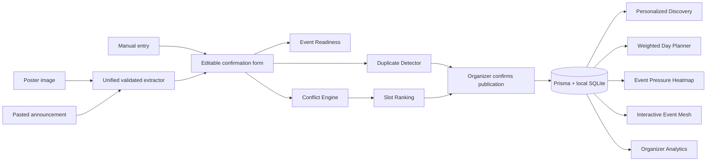

# EventMesh IITH

**One intelligent event layer for the entire campus.**

EventMesh turns fragmented campus announcements into a searchable, explainable, conflict-aware event network. Built for the Lambda Hackathon theme **Smart Campus Solutions for IITH**.

> **Demo data:** All seeded events, venues, organizer names, popularity values, and attendance estimates are illustrative. They are not the official IIT Hyderabad calendar, venue booking system, or live campus statistics. User-created events live only in the local SQLite database.

## Why EventMesh is different

| Traditional event listing | EventMesh campus intelligence |
| --- | --- |
| Create → list → register | Ingest → understand → detect → optimize → recommend → coordinate |
| Students search scattered announcements | Students see personalized discovery and an optimized day plan |
| Organizers guess whether a slot is good | Organizers inspect venue, audience, duplicate, and event-pressure signals |
| Scores appear as opaque badges | Every signal has a short explanation and deterministic formula |

The product connects three daily campus problems: discovering relevant events, turning messy announcements into structured listings, and choosing times that work for the community.

## Working features

### Student experience

- Search by title, organizer, category, tag, or venue; filter by date and category.
- Explainable 0–100 recommendations using demo interests, category preferences, time, popularity, and organizer affinity.
- Event details, related events, registration deadlines, and saved-event clash warnings.
- Interested, Saved, and Must Attend priorities persisted in SQLite.
- **Build My Plan:** weighted interval scheduling selects the highest-utility set of non-overlapping events and explains skipped events.
- Export one event or the current schedule/optimized plan as a local `.ics` calendar file.

### Organizer experience

- Create an event manually, upload a poster for optional AI vision extraction, or paste a text announcement.
- If no API key is configured, pasted text uses a **clearly labeled deterministic local parser**; poster extraction falls back to manual entry. Extracted fields are always editable and never auto-published.
- Zod validation, a transparent Event Readiness score, and duplicate suggestions before publishing.
- Conflict Intelligence distinguishes venue collisions from audience overlap, shows reasons, and offers lower-conflict alternatives.
- Scheduling Intelligence compares candidate dates, time windows, durations, audience tags, and venues using the same conflict engine.
- A clickable weekly Event Pressure heatmap blends simultaneous events, shared interests, category concentration, estimated audience, and occupied venues.
- Organizer dashboard computes event counts, high-conflict events, quieter hours, readiness, category mix, audience pairs, and pressure from current local data.
- Interactive Event Mesh graph connects events, organizers, interests, and shared audiences.

## Run locally

**Requirements:** Node.js 24 or another Node.js release supported by Next.js 16, npm. No hosted database is required.

```bash
git clone https://github.com/QuantumArnav/Eventmesh.git eventmesh-iith
cd eventmesh-iith
npm install
```

Create `.env` from `.env.example`:

```powershell
# Windows PowerShell
Copy-Item .env.example .env
```

```bash
# macOS / Linux
cp .env.example .env
```

Start the local database and app:

```bash
npm run db:setup
npm run dev
```

Open **http://localhost:3000**. `db:setup` creates SQLite, applies the committed migrations, and inserts 18 labeled demo events, a demo student profile, and a six-event plan. It is safe to rerun: existing events and choices remain. If port 3000 is busy, use the URL printed by Next.js.

### Environment variables

| Variable | Purpose |
| --- | --- |
| `DATABASE_URL` | Local SQLite path; default `file:./dev.db` |
| `OPENAI_API_KEY` | Optional key for poster vision and AI text extraction |
| `OPENAI_VISION_MODEL` | Optional compatible vision model; default `gpt-4.1-mini` |

The key stays on the server and is not exposed as `NEXT_PUBLIC_`. With no key, the entire demo remains usable. Local text parsing handles simple announcements and is identified as a local parser in the interface. AI extraction requires a valid key and available quota; it has not been live-tested without a key.

There are no demo credentials. **Discover / My Schedule** are the student view; **Organizer / Create event / Scheduling / Event Mesh** are organizer intelligence views. Production authentication and official campus integrations are outside this hackathon MVP.

## Three-minute judge walkthrough

1. **Discover:** search for `AI` and open a card. Show its relevance score and plain-language reason.
2. **My Schedule:** the fresh demo database already contains six tracked events. Select **Build my plan**; the optimizer keeps compatible events and explains why it skips a clash. Change an event to **Must Attend** and recalculate instantly.
3. **Organizer → Create event → Paste announcement:** click **Use demo announcement**, then **Extract details**. With no API key, the interface explicitly says **Local text parser**. All fields remain editable.
4. **Check conflicts:** the seeded scenario produces a **high-similarity possible duplicate**, a **100/100 LH3 venue collision**, and a separate programming-audience overlap. Open the existing listing or continue reviewing.
5. **Scheduling:** compare ranked alternative slots. Click the **third demo day at 6 PM** on the heatmap to see contributing events, audience estimate, tags, and pressure explanation. Show the lower-conflict 8 PM option.
6. **Event Mesh:** click the AI workshop, Programming interest, and connected events to show how organizers and audiences relate. If time permits, return to the create form, apply a better slot, and publish.

All of these results are calculated from the local demo data, not hardcoded into the screens. On a fresh setup, dates are generated relative to the setup day so the scenario remains usable.

## Architecture



This is one Next.js application. API routes own writes and provider calls. Pure TypeScript modules hold the algorithms and are tested independently from the UI. The only schema extension beyond the first MVP is a `preference` field on saved events; its additive migration preserves existing rows with `SAVED` as the default.

## The intelligence, explained

These are deterministic decision aids, not predictions of actual attendance, official room availability, or a trained ML model.

| Engine | How it works |
| --- | --- |
| **Conflict** | First require real time overlap. Same-venue score starts at 55 and adds overlap, tag similarity, and category points. Different venues use overlap, tag Jaccard similarity, category, and bounded audience size. Results include kind, severity, and reasons. |
| **Scheduling** | Enumerate 30-minute starts across the requested window, venues, and up to three days. Run the conflict engine for every candidate. Combined score is `0.7 × worst conflict + 0.3 × mean conflict + 15 if venue collides`. Rank available venues first, then lower score. |
| **Duplicate** | Weighted similarity: title 32, organizer 18, date 22, start time 10, venue 10, tags 8. Title uses token Jaccard and normalized edit distance. Distant dates sharply reduce the score; a match needs at least 70/100 and a sufficiently similar title. Organizers may continue anyway. |
| **Event Pressure** | Hourly score combines event count (up to 35), pairwise audience-tag similarity (up to 20), category concentration (15), estimated audience (15), and fraction of listed venues occupied (15). Empty hours score zero. Click a cell for contributing events and reasons. |
| **Event Readiness** | Field completeness: title 10, date 15, valid time range 15, venue 15, useful description 10, category 10, tags 10, deadline 5, organizer 5, estimated audience 5. Missing optional details lower the score but never block publication. |
| **Recommendation** | Interest match 45, category 20, suitable time 15, demo popularity 10, organizer affinity 10. The score is bounded to 0–100 and includes reasons. |
| **Day Planner** | Weighted interval scheduling. Utility is recommendation score + 80 for Must Attend or + 20 for Saved, plus one point. Sort by end time, find the previous compatible event, use dynamic programming, and reconstruct the optimum. |
| **Event Mesh** | A small graph of upcoming events, organizers, and prominent tags. Dotted audience links require at least 15% tag Jaccard overlap; clicking nodes reveals the actual connection. |

## Technical stack

- Next.js 16 App Router, React 19, strict TypeScript
- Tailwind CSS 4 / custom design system, Lucide icons
- Prisma 6 + local SQLite with committed migrations and seed data
- Zod 4 validation
- OpenAI Responses API for optional vision/text extraction
- Vitest for algorithmic tests

```text
app/                Pages and API route handlers
components/         Navigation and reusable event UI
lib/                Pure engines, dates, validation, database access
lib/ai/             Unified optional extraction provider
prisma/             Schema, additive migrations, demo seed
scripts/            Local SQLite setup helper
tests/              Engine and export tests
```

## Development checks

```bash
npm run typecheck
npm run lint
npm test
npm run build
```

## Visual tour

Run the app and visit these screens for the actual interactive visuals:

1. `/discover` — personalized event cards and search.
2. `/my-schedule` — timeline, priority controls, and optimized plan.
3. `/organizer/create` — announcement/poster intake, readiness, duplicate and conflict review.
4. `/organizer/scheduling` — ranked slots and clickable seven-day heatmap.
5. `/event-mesh` — interactive organizer-event-interest graph.

Static screenshots are not checked in; the live application is the source of truth for the submission.

## Limits and next steps

The app does not ingest private WhatsApp messages, emails, or club pages automatically. It processes only a poster or announcement intentionally provided in the create form. It does not reserve official venues. Organizer and student roles use one clearly labeled local demo profile, not production authentication. A campus deployment would need identity/permissions, verified organizers, official venue feeds, and consent-aware data handling.

## Team

- **Team members:** Arnav and Vikas Gupta
- **Hostel:** Bhabha

## Open-source acknowledgements

Built during the hackathon using the open-source frameworks and libraries listed in `package.json`: Next.js, React, Prisma, Zod, Tailwind CSS, Lucide, and Vitest. No pre-existing EventMesh application code or external UI template was used. Optional extraction calls the OpenAI API through its SDK.
